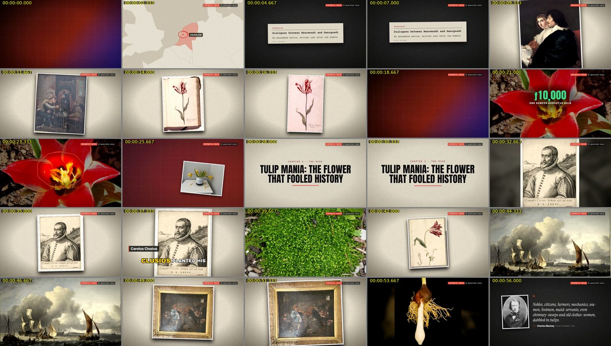
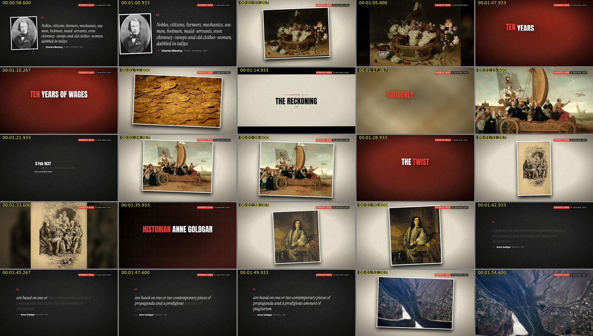

# DocumentaryMaker

**Transformez une idée en documentaire YouTube long format (15 à 30 min et plus), sourcé, narré et monté automatiquement.**
Exemple : « La rupture catastrophique de Johnny Depp », 25 minutes, en français.

```
idée → recherche sourcée → plan + thèse → script long format (FR / EN) → beats (une idée visuelle par phrase)
     → images, b-roll, documents, extraits YouTube → voix off (ElevenLabs, voix locale ou votre voix)
     → montage « drama-commentary » automatique (transitions, keyframes, sous-titres, motion design, sound design)
     → MP4 + export du montage vers DaVinci Resolve, Premiere Pro et Final Cut Pro
```

Deux façons de travailler : la **ligne de commande** `docmaker` et une **application web locale** (http://127.0.0.1:3210). Tout tourne sur votre machine ; seules les API que vous configurez sont appelées.

Pas à pas complet sur un vrai sujet : **[docs/GUIDE-FR.md](docs/GUIDE-FR.md)**.




*Planches contact de la démo `tulip-mania` (`pnpm docmaker demo --online`, aperçu `draft` 960×540) : une vignette toutes les 2,3 s. Le bandeau rouge « SYNTHETIC VOICE » signale la voix de démonstration.*

---

## Sommaire

- [Ce que fait l'application](#ce-que-fait-lapplication)
- [Démarrage rapide](#démarrage-rapide)
- [L'application web](#lapplication-web)
- [Configuration et clés d'API](#configuration-et-clés-dapi)
- [Coûts et plafonds](#coûts-et-plafonds)
- [Styles de montage](#styles-de-montage)
- [Extraits YouTube](#extraits-youtube)
- [Juridique et sécurité éditoriale](#juridique-et-sécurité-éditoriale)
- [Commandes](#commandes)
- [Architecture](#architecture)
- [Limites et feuille de route](#limites-et-feuille-de-route)
- [English summary](#english-summary)

---

## Ce que fait l'application

| Étape | Ce qui se passe | Vous intervenez ? |
|---|---|---|
| **Projet** | Idée, langue(s) FR/EN, durée cible (5–60 min). Un style est suggéré instantanément, hors ligne. | Vous confirmez le style. |
| **Recherche** | Claude cherche et lit le web : dossier cité, registre des sources (uniquement des URL réellement consultées), fiche de faits (personnes, dates, citations vérifiées dans la page source, chiffres, affaires judiciaires avec **statut, juridiction et date**). | — |
| **Plan** | Chapitres, actes, durées calculées, accroches, **thèse** du film. | Vous **confirmez la thèse** et approuvez le plan. |
| **Script** | Écrit nativement en français et/ou en anglais, chapitre par chapitre ; contrôle automatique (formulations accusatoires, attributions, rythme). | Vous éditez librement ; vos modifications ne sont jamais écrasées. |
| **Beats** | Chaque phrase devient une idée visuelle (photo, document, carte, chiffre, citation, extrait…). Tout texte affiché à l'écran est relié à la fiche de faits. | Vous pouvez remplacer n'importe quel média. |
| **Vérification des faits** | Passe « avocat » sur la narration, les textes à l'écran, le titre et la miniature. | Vous traitez chaque point à risque (corriger ou assumer avec une note). |
| **Médias** | Wikimedia Commons, Openverse, Internet Archive, NASA, Library of Congress (sans clé), Pexels/Pixabay (clé gratuite), Brave et fal (payants, optionnels), vos fichiers, et **extraits YouTube via yt-dlp sur votre machine**. Licences vérifiées, crédits générés. | Optionnel. |
| **Voix off** | Prise **brouillon** gratuite pour tout prévisualiser, puis ElevenLabs, voix locale (Kokoro/Piper) ou **votre propre voix** (prompteur intégré, alignement automatique). | Vous choisissez la voix. |
| **Montage** | Un réalisateur déterministe compose la timeline : Ken Burns, punch-ins, transitions, cartons de chapitre, citations animées, mots-chocs, sous-titres par mots-clés, SFX, musique, ducking, silences avant les révélations. | Retouches dans l'aperçu (retirer un habillage, changer une transition…). |
| **Rendu** | Remotion, par chapitres mis en cache ; mixage à −14 LUFS ; préréglages `draft` (960×540, rapide) et `master` (1920×1080, grain + LUT). | — |
| **Export** | FCPXML 1.10 (Final Cut, Resolve), XML Premiere / Resolve, OTIO, marqueurs EDL, SRT, stems audio, crédits, kit de publication (titre, description, chapitres), rapport éditorial. | Vous finissez dans votre logiciel si vous le souhaitez. |

---

## Démarrage rapide

**Prérequis** : Linux x64 ou macOS (Windows : via WSL2), **Node.js 22.12+** (22.x), **pnpm 10**, **ffmpeg ≥ 6.1** (avec ffprobe). Optionnel : **Python 3.11–3.12** (transcription de votre voix avec faster-whisper, yt-dlp via le venv), `xmllint`.

Vous n'avez que `npm` ? Installez pnpm avec lui (le dépôt utilise des workspaces pnpm : `npm install` ne fonctionne pas) :

```sh
npm install -g pnpm@10.28.0       # ou : corepack enable (Corepack est fourni avec Node 22)
pnpm --version                    # doit afficher 10.28.0
```

Sous Windows, utilisez un terminal **WSL2** (Ubuntu) et installez-y Node 22, pnpm et ffmpeg : la v1 ne prend pas en charge Windows en natif (`pnpm docmaker doctor` le signale).

```sh
git clone https://github.com/noazzouzi/DocumentaryMaker.git
cd DocumentaryMaker
pnpm install --frozen-lockfile

pnpm docmaker setup --browser     # télécharge Chrome Headless Shell pour le rendu (une seule fois)
pnpm docmaker doctor              # vérifie Node, ffmpeg, navigateur, clés, licence Remotion, disque…
```

### Première vidéo, sans clé ni réseau

```sh
pnpm docmaker demo --offline      # alias : pnpm demo
```

La démo rejoue un projet enregistré (« Tulip mania », ~2 min) avec des images procédurales et une voix synthétique, puis affiche le chemin du MP4, du dossier d'export et le résumé qualité. Comptez environ 15 à 25 min sur 4 cœurs CPU.

```sh
pnpm docmaker demo --online       # mêmes script et voix, mais vraies images (Commons, Openverse…)
pnpm docmaker demo --lang fr      # version française (--lang all : les deux)
pnpm docmaker demo --only-chapters CH1 --preset draft   # plus court pour un essai
```

### Votre premier vrai projet

Claude écrit la recherche, le plan, le script et la vérification. Deux façons de l'utiliser, au choix :

**Avec votre abonnement Claude (Pro ou Max), sans clé API.** DocumentaryMaker lance le programme officiel `claude` (Claude Code), connecté à votre compte. Installez-le là où tourne DocumentaryMaker (sous Windows : dans Ubuntu/WSL, pas la version Windows) :

```sh
curl -fsSL https://claude.ai/install.sh | bash    # installe Claude Code
claude auth login                                 # connexion avec votre compte Claude (une seule fois)
pnpm docmaker setup --llm claude-code             # les nouveaux projets utiliseront votre abonnement
```

**Avec une clé API Anthropic** (facturée à l'appel) :

```sh
pnpm docmaker keys set ANTHROPIC_API_KEY          # saisie masquée, écrite dans ~/.documentarymaker/.env (0600)
```

Puis :

```sh
pnpm docmaker new "La rupture catastrophique de Johnny Depp" --lang fr --minutes 25
pnpm docmaker run la-rupture-catastrophique-de-johnny-depp
```

`run` avance jusqu'à la prochaine validation humaine, explique quoi faire (code de sortie 3), puis reprend avec `--resume`. Le détail est dans le [guide](docs/GUIDE-FR.md). `--llm claude-code` ou `--llm anthropic` sur `new` choisit le moteur d'un projet précis.

### Mode autopilote : du sujet à la vidéo, sans intervention

```sh
pnpm docmaker auto "Le terrible secret de Johnny Depp" --lang fr --minutes 15
pnpm docmaker auto --project <slug>               # reprendre (ou passer en autopilote) un projet existant
```

`auto` crée le projet et enchaîne tout, jusqu'au MP4 final (1080p `master` par défaut, `--preset draft` pour aller plus vite) et à l'export. Toutes les validations sont automatiques : style, thèse, personnes non publiques, avertissement YouTube, réévaluation des affaires en cours, coûts (les plafonds de 25 $ par étape et 40 $ par projet s'appliquent toujours) et points de la vérification des faits, **validés tels quels**. Seules les citations introuvables dans leur source, ou non verbatim, sont réécrites automatiquement en paraphrase attribuée (le code refuse de les valider). Une vérification périmée est relancée, une étape en échec relancée une fois. Si la limite de votre abonnement Claude est atteinte, relancez plus tard `auto --project <slug>` : rien n'est refait.

Chaque validation automatique est enregistrée (`approvals.json`, rapport éditorial) avec la mention « autopilot ». Deux protections restent intouchables : un mineur ou une victime privée n'est jamais nommé ni montré, et aucune image IA ne représente une personne réelle. **Ce que vous publiez reste sous votre responsabilité** : relisez au moins `editorial-report.fr.md` avant de mettre en ligne.

Les projets sont rangés dans `projects/<slug>/` à la racine du dépôt (ou `DOCMAKER_PROJECTS`) ; les caches, modèles et styles personnels dans `~/.documentarymaker/` (ou `DOCMAKER_HOME`).

---

## L'application web

```sh
pnpm dev:web                      # http://127.0.0.1:3210 (local, mono-utilisateur)
# ou en mode production :
pnpm --filter @docmaker/web build && pnpm --filter @docmaker/web start
```

L'interface est en français ou en anglais (bascule dans l'en-tête). Écrans principaux :

| Écran | Rôle |
|---|---|
| **Installation** (`/setup`) | Premier lancement : navigateur de rendu, voix locales, Python, clés (avec consentement explicite), contact Wikimedia, **choix de la licence Remotion**, démo. |
| **Projets** (`/`) | Liste des projets, prochaine action, « Nouveau projet », « Lancer la démo hors ligne ». |
| **Nouveau projet** | Idée, langues, durée, **suggestion de style instantanée** (bouton « Demander à Claude » pour affiner), estimation du coût total. |
| **Vue d'ensemble** | Chaîne de production (fait / périmé / bloqué), bandeaux de validation, « Lancer la suite », journal en direct, dépenses vs plafond. |
| **Recherche** | Dossier, sources, personnes, chronologie, affaires (statut, juridiction, date), citations vérifiées. |
| **Plan** | Thèse (« Je confirme cette thèse »), chapitres, budget de durée, « Approuver le plan ». |
| **Script** | Édition par chapitre, verrouillage, historique, **panneau de vérification** (Appliquer la réécriture / Assumer / Écarter), prompteur. |
| **Scènes** | Tableau des beats, médias choisis avec badge de licence, « Changer » → recherche, import avec déclaration de licence, extraits. |
| **Voix** | Prise brouillon, ElevenLabs / Kokoro / Piper, estimation, import de vos enregistrements, enregistreur-prompteur dans le navigateur. |
| **Aperçu** | Lecteur Remotion synchronisé avec le script (cliquer un mot = s'y rendre), retouches d'habillages et de transitions. |
| **Rendu et export** | Rendu du film entier ou de chapitres, téléchargement, rapport qualité, « Exporter le montage seul ». |
| **Publication** / **Crédits** | Titre, miniature, description (revérifiés), kit de publication ; registre des médias et `credits.md`. |
| **Styles** / **Réglages** | Galerie des styles, « Nouveau style à partir de… » ; clés (masquées, bouton Tester), contact, langue, diagnostic. |

Les tâches longues (recherche, rendu…) tournent dans un processus séparé : vous pouvez fermer l'onglet et revenir.

---

## Configuration et clés d'API

**Aucune clé n'est nécessaire pour la démo.** Pour un vrai projet, renseignez seulement ce dont vous avez besoin, au choix :

- `pnpm docmaker keys set <NOM>` ou l'écran **Réglages** → écrit `~/.documentarymaker/.env` (permissions 0600) ;
- `.env.local` à la racine du dépôt (ignoré par git), en partant de [`.env.example`](.env.example).

Priorité : variables d'environnement > `~/.documentarymaker/.env` > `.env.local`. Les clés ne sont jamais copiées dans un projet, un journal ou l'interface (affichage masqué).

| Variable | Sert à | Sans elle |
|---|---|---|
| `ANTHROPIC_API_KEY` | recherche, plan, script, beats, vérification (Claude), facturés à l'appel | utilisez votre abonnement Claude (`setup --llm claude-code`, ci-dessous), sinon seuls les projets « fixture » (démo) fonctionnent |
| `ELEVENLABS_API_KEY` | voix off ElevenLabs (payante) | prise brouillon, Kokoro/Piper ou votre voix |
| `PEXELS_API_KEY`, `PIXABAY_API_KEY` | b-roll et photos libres (clés gratuites) | les sources sans clé restent actives |
| `FAL_KEY` | illustrations générées (payant ; **jamais** pour une personne réelle) | pas d'images IA |
| `BRAVE_API_KEY` | recherche d'images éditoriales (payant, licence inconnue → usage encadré) | — |
| `DOCMAKER_CONTACT` | votre e-mail ou URL dans le User-Agent envoyé **uniquement** à Wikimedia / Wikidata / Openverse (étiquette Wikimedia ; limite les erreurs 429) | requêtes anonymes, plus souvent limitées |
| `REMOTION_LICENSE_KEY` | clé de licence entreprise Remotion, si votre structure en a besoin | — |
| `DOCMAKER_AUTO_APPROVE_USD` | approuve automatiquement les estimations sous ce montant | chaque coût est demandé |

Autres réglages utiles : `DOCMAKER_HOME`, `DOCMAKER_PROJECTS`, `DOCMAKER_OFFLINE=1` (aucune connexion), `DOCMAKER_BROWSER_EXECUTABLE` (Chrome déjà installé), `DOCMAKER_CACHE_MAX_GB`, `DOCMAKER_CLAUDE_BIN` (chemin du programme `claude`, à exporter dans le shell). Liste complète et commentée : [`.env.example`](.env.example). Vérifier : `pnpm docmaker keys list` et `pnpm docmaker keys test anthropic`.

### Abonnement Claude (Claude Code) au lieu d'une clé API

Avec le moteur `claude-code`, chaque appel lance `claude -p` (le programme officiel, non modifié), connecté à **votre** compte :

- l'appel est isolé de votre configuration Claude Code (`--safe-mode` : ni CLAUDE.md, ni plugins, ni MCP ; dossier de travail vide ; aucune session enregistrée) ;
- `ANTHROPIC_API_KEY` est retirée de son environnement : c'est bien l'abonnement qui est utilisé, jamais une clé ; DocumentaryMaker ne lit jamais vos identifiants Claude ;
- les étapes Claude coûtent 0 $ (pas de validation de coût pour elles) ; la limite, c'est le quota de votre abonnement : un documentaire de 25 min consomme beaucoup, Max est recommandé. Une étape relancée réutilise sa réponse sans reconsommer ;
- la recherche web passe par les outils de recherche et de lecture de pages de Claude Code. La liste des sources ne garde que les URL réellement renvoyées par ces outils (une URL citée sans avoir été vue est retirée). Les extraits par source sont vides (l'API seule les fournit) ; la vérification des citations mot à mot, elle, ne change pas ;
- `pnpm docmaker doctor` vérifie que `claude` est installé (version Linux sous WSL) et connecté avec un abonnement, pas une clé API ;
- usage personnel : c'est votre abonnement, pour vos projets ; ne le partagez pas via une instance accessible à d'autres.

## Coûts et plafonds

- Chaque étape payante affiche une **estimation avant de s'exécuter** ; une seule approbation couvre un `run` (`--yes`, `--max-cost <usd>` ou bouton « Approuver … $ »).
- Plafonds par défaut : **25 $ par étape**, **40 $ par projet** ; une étape qui dépasse nettement son estimation s'arrête.
- Un appel payant identique n'est jamais refait (reçus) ; `--new-request` force un nouvel appel.
- Ordres de grandeur : **Claude ~5–10 $ pour un script de 30 min** avec une clé API (recherche comprise ; 0 $ avec votre abonnement Claude, qui consomme alors votre quota), **ElevenLabs ~2 $ par prise française de 25 min** (selon votre abonnement). Les sources d'images sans clé, la prise brouillon, les voix locales, le montage, le rendu et l'export sont gratuits.
- `pnpm docmaker cost <slug>` : estimations, dépenses, total vs plafond.

---

## Styles de montage

Un style est un **dossier de données** (aucun code) : `style.json` (rythme, transitions, palette, polices, SFX, musique…), `STYLE.md` (la charte), `GUIDE.md`, `prompts.json`.

| Style | Pour | Caractère |
|---|---|---|
| `drama-commentary` | chutes, scandales, faillites, drama Internet | narrateur sûr de lui, montage de thriller, mots-chocs, révélations ponctuées |
| `cinematic-essay` | histoire, mystères, culture, idées | format 2.39, longs fondus, narration retenue, silences |
| `true-crime-dossier` | crimes, disparitions, procès | dossier d'enquête sobre, statuts judiciaires toujours explicites, jamais sensationnel |

**Suggestion automatique** : dès que vous tapez l'idée, un classement hors ligne gratuit propose un style (ex. « rupture » → `drama-commentary`) ; vous pouvez l'affiner avec Claude (`docmaker style <slug> --llm`, quelques centimes), puis vous confirmez (`--pick <id> --confirm`).

**Créer votre style** en un dossier :

```sh
pnpm docmaker style new mon-style --from drama-commentary   # copie dans ~/.documentarymaker/styles/mon-style/
# modifiez style.json et STYLE.md, puis :
pnpm docmaker style validate ~/.documentarymaker/styles/mon-style
pnpm docmaker style preview mon-style                       # planche de spécimen
```

Équivalents : écran **Styles** → « Nouveau style à partir de… », ou `scaffoldStyle()` de `@docmaker/styles`. Le style est découvert au démarrage, sans recompilation. Donnez-lui un nom descriptif, jamais celui d'une chaîne. Plus de détails : [`docs/EXTENDING.md`](docs/EXTENDING.md).

---

## Extraits YouTube

- **yt-dlp s'exécute localement, sur votre machine, à votre demande** (`pnpm docmaker setup --yt-dlp`). Rien ne passe par un serveur tiers.
- Avant le premier téléchargement, l'avertissement sur le droit de citation doit être accepté (écran Vue d'ensemble ou `docmaker approve <slug> fair-use --note "…"`).
- L'outil cherche la vidéo, lit la transcription, trouve le passage, coupe avec des marges (20 s max par défaut) et journalise URL, chaîne et timecodes dans les crédits et le rapport éditorial.
- Si YouTube bloque (vérification anti-robot, 403), importez l'extrait vous-même : `docmaker assets clip <slug> <segmentId> --url <URL> --from 01:02 --to 01:14` (ou `--file`). `--no-youtube` désactive les extraits.
- **Votre responsabilité** : télécharger peut enfreindre les conditions d'utilisation de YouTube. Le *fair use* américain et le **droit de citation** français (plus étroit) exigent des extraits **courts, commentés, nécessaires à votre propos**, avec la source citée. La mention « Source : » n'est pas une protection juridique.

## Juridique et sécurité éditoriale

- **Validations bloquantes** : thèse et plan approuvés ; chaque point à risque de la vérification des faits traité (corrigé, ou assumé avec une note d'au moins 10 caractères) avant la voix finale, le rendu et l'export ; toute modification du script ou des textes à l'écran **réarme** la vérification. `--yes` n'approuve **jamais** une validation éditoriale.
- **Statut des affaires** : chaque allégation porte un statut (`allegation`, `charged_pending`, `judicial_finding_civil`, `criminal_conviction`, `acquitted`, `settled_no_admission`, `appeal_pending`…), une **juridiction** et une **date**. La narration doit en suivre la formulation (« un jury de Virginie a estimé que… », jamais « X a menti »). Les statuts en cours de plus de 30 jours doivent être revérifiés (`docmaker factcheck <slug> --recheck`).
- **Pas d'image IA de personnes réelles** (bloqué à chaque niveau ; les illustrations IA portent la mention « ILLUSTRATION »). Les portraits de personnes réelles sont de vraies photos, choisies pour la ressemblance. Les personnes privées et les mineurs ne sont jamais nommés, recherchés ni montrés ; une personne non publique demande votre approbation (`docmaker persons`).
- **Licences et crédits** : chaque média passe la politique de licences (revérifiée côté serveur, y compris pour vos imports, avec déclaration obligatoire). `credits.<lang>.md` liste auteur, licence et lien vers l'acte de licence (CC BY, BY-SA…), et les modifications (« recadré et animé »).
- **Licence Remotion** : Remotion est **gratuit pour les particuliers et les entreprises de 3 personnes au plus** (et les associations) ; au-delà, une licence entreprise est nécessaire. L'écran Installation vous demande votre situation et ne la choisit jamais à votre place ; vous en restez responsable.
- Ces garde-fous **réduisent** les risques (diffamation, droits) mais **ne sont pas un conseil juridique**. Voir [`docs/LEGAL.md`](docs/LEGAL.md) et [`NOTICE.md`](NOTICE.md).

---

## Commandes

Toutes s'appellent avec `pnpm docmaker <commande>` (aide : `pnpm docmaker <commande> --help`). Options globales : `--yes` (coûts et style seulement), `--max-cost <usd>`, `--force`, `--json`, `--home`, `--projects-dir`.

| Commande | Rôle |
|---|---|
| `doctor` | diagnostic de l'environnement |
| `setup --browser \| --yt-dlp \| --python \| --tts kokoro \| --tts piper:<voix> \| --whisper faster-whisper \| --sfx \| --all` | installe les composants optionnels |
| `demo [--offline \| --online] [--lang en\|fr\|all] [--preset draft\|master] [--only-chapters CH1]` | démo complète |
| `keys set <NOM>` / `keys test <NOM>` / `keys list` | clés d'API |
| `new "<idée>" --lang fr --minutes 25 [--style auto\|<id>]` | crée un projet, propose un style, estime le coût |
| `status [slug]` | état des étapes (sans slug : liste des projets) |
| `run <slug> [--to <étape>] [--resume <jobId>]` | enchaîne les étapes jusqu'à la prochaine validation |
| `style <slug> [--pick <id>] [--confirm] [--llm]` | choisir / confirmer le style |
| `style new <id> --from <base>` / `style validate <dossier>` / `style preview <id>` | créer, vérifier, prévisualiser un style |
| `research <slug> [--resume]` | recherche |
| `outline <slug> [--confirm-thesis] [--approve]` | plan et thèse |
| `script <slug> [--lang fr] [--chapter CH3] [--transcreate <ids>]` | (ré)écrire des chapitres |
| `beats <slug> [--replan CH3,CH4]` | plans visuels |
| `factcheck <slug> [--ack <ids>] [--ack-file <json>] [--dismiss <ids>] [--note …] [--recheck]` | vérification des faits |
| `persons <slug> [--ack <id> --note …]` | personnes non publiques |
| `approve <slug> <validation>` | validation générique (`fair-use`, `cost`, `recheck`…) |
| `assets <slug> [--offline] [--no-youtube] [--allow-paid] [--beat <id>]` | médias |
| `assets import <slug> <dossier> --declare own-work\|licensed:…\|third-party:<url>\|ai-generated` | importer vos fichiers |
| `assets clip <slug> <segmentId> --url\|--file … --from mm:ss --to mm:ss` | extrait manuel |
| `voice <slug> [--scratch] [--provider elevenlabs\|kokoro\|piper\|synthetic] [--voice <id>]` | prise de voix |
| `voice import <slug> <fichiers…>` / `voice calibrate <slug>` / `voice teleprompter <slug>` | votre voix |
| `layout` / `direct` / `mix <slug>` | horloge audio, montage, mixage |
| `preview <slug> [--sheet] [--studio] [--web]` | images fixes, planche contact, Remotion Studio |
| `render <slug> [--preset draft\|master] [--chapters CH2] [--range a:b]` | rendu MP4 |
| `export <slug> [--export-root <chemin>] [--fcpxml-version 1.10\|1.11\|1.13]` | export du montage (sans rendu préalable) |
| `qa <slug>` / `credits <slug>` / `cost <slug>` / `jobs <slug> [--cancel <id>]` / `cache gc` | contrôle qualité, crédits, coûts, tâches, cache |

Codes de sortie : 0 succès, 1 erreur, 2 usage, **3 validation requise**, 4 annulé.

Scripts du dépôt : `pnpm typecheck`, `pnpm lint`, `pnpm test`, `pnpm test:render`, `pnpm test:e2e`, `pnpm check:deps`, `pnpm smoke`. Environnement de développement : [`docs/DEV.md`](docs/DEV.md).

---

## Architecture

```
packages/
  core/      contrat de données : schémas zod, interfaces, chemins, utilitaires, ProjectStore
  styles/    styles = dossiers de données (style.json, STYLE.md, GUIDE.md, prompts.json), suggestion, scaffoldStyle
  llm/       client Claude, prompts, étapes (recherche → vérification), lint de script, fixtures hors ligne
  assets/    sources de médias, politique de licences, cache, pertinence, YouTube (yt-dlp local), crédits
  voice/     texte TTS, ElevenLabs / Kokoro / Piper / synthétique, alignement, import de vos enregistrements
  audio/     SFX et musique procéduraux, mixeur, loudness
  director/  horloge audio (layout) et réalisateur déterministe → Timeline
  remotion/  compositions et composants visuels (navigateur)
  render/    bundle, rendu par morceaux mis en cache, concaténation, mux, contrôle loudness
  export/    FCPXML, xmeml, OTIO, EDL, SRT, kit de publication, rapport éditorial
  engine/    étapes, validations, coûts, tâches, démo
apps/
  cli/       la commande `docmaker` + le worker de tâches
  web/       application Next.js 16
python/      sidecar optionnel (faster-whisper, yt-dlp, analyses)
```

Principes : **le moteur possède la timeline, le LLM ne remplit que des paramètres** ; **l'audio est l'horloge** (tout est ancré sur des mots) ; **une seule timeline** pour le rendu, l'aperçu, le mixage, les sous-titres et les exports ; **hors ligne d'abord** ; **votre travail n'est jamais perdu** (historique des documents modifiés). Spécification complète : [`docs/ARCHITECTURE.md`](docs/ARCHITECTURE.md).

## Limites et feuille de route

Version 1 : 16:9 uniquement, rendu CPU local, un utilisateur, Windows via WSL2 seulement. Pas encore inclus :

- motion design « héros » écrit par l'IA, boucle de contrôle visuel par Claude (les planches contact sont déjà générées) ;
- style `vox-collage`, parallaxe 2.5D et détourage de personnes, survols de cartes réelles (v1 : carte hors ligne avec repère) ;
- rampes de vitesse, recalage de musiques de bibliothèque sur le montage, génération payante de musique / SFX / vidéo ;
- nettoyage automatique de vos enregistrements (hésitations, silences) ;
- `.otioz`, médias intermédiaires DNxHR/ProRes, sous-titres animés en piste ProRes ;
- formats verticaux 9:16 et mise en ligne YouTube (les chapitres de description sont déjà dans le kit de publication) ;
- multi-utilisateur, ferme de rendu GPU, Windows natif, sources Unsplash / Freesound / Flickr / Jamendo, composants React propres à un style.

Détail : section 1.2 de [`docs/ARCHITECTURE.md`](docs/ARCHITECTURE.md).

Code sous licence MIT ([`LICENSE`](LICENSE)) ; les dépendances et idées reprises conservent leurs licences ([`NOTICE.md`](NOTICE.md)).

---

## English summary

DocumentaryMaker turns an idea (e.g. "Johnny Depp's catastrophic breakup", 25 min) into a long-form drama-commentary YouTube documentary: sourced research with Claude, an approved outline and thesis, a script written natively in French and/or English, beats tied to a fact sheet, a fact-check with human approval gates, licensed images/b-roll/YouTube clips (yt-dlp runs locally) with automatic credits, a voice-over (free scratch take, ElevenLabs, local Kokoro/Piper, or your own recording with a teleprompter), a deterministic director (transitions, keyframes, captions, motion design, sound design), Remotion rendering with a −14 LUFS mix, and exports to DaVinci Resolve, Premiere Pro and Final Cut Pro (FCPXML, xmeml, OTIO, EDL, SRT, stems, publish kit).

**Quick start:** Node 22.12+, pnpm 10, ffmpeg ≥ 6.1 (Python 3.11–3.12 optional) → `pnpm install --frozen-lockfile`, `pnpm docmaker setup --browser`, `pnpm docmaker doctor`, `pnpm docmaker demo --offline` (no keys, no network) or `--online`. Web app: `pnpm dev:web` → http://127.0.0.1:3210. Keys (`ANTHROPIC_API_KEY`, `ELEVENLABS_API_KEY`, `PEXELS_API_KEY`, `PIXABAY_API_KEY`, `FAL_KEY`, `BRAVE_API_KEY`, `DOCMAKER_CONTACT`) go in `~/.documentarymaker/.env` (`docmaker keys set`) or `.env.local`; every paid step shows an estimate first, with caps of $25 per stage and $40 per project. **No API key?** Use your Claude Pro/Max subscription: install Claude Code where docmaker runs (`curl -fsSL https://claude.ai/install.sh | bash`, then `claude auth login`) and run `pnpm docmaker setup --llm claude-code`; every LLM call then runs the unmodified `claude -p` CLI signed in with your account (isolated with `--safe-mode`, API keys removed from its environment), at $0 per call against your subscription quota. **No human step:** `pnpm docmaker auto "<subject>"` creates the project in autopilot and runs everything to the final MP4 (master preset) and the export: every gate approves itself (recorded as "autopilot" in approvals.json and the editorial report, fact-check items accepted as they are), quotes that cannot be acknowledged (not found on their source, not verbatim) are rewritten as attributed paraphrase, a stale fact-check is re-run; minors and private victims are still never named or shown, and you remain responsible for what you publish.

**Styles:** `drama-commentary`, `cinematic-essay`, `true-crime-dossier`, suggested automatically from the idea; add your own as a data-only folder with `docmaker style new <id> --from <base>`.

**Legal:** clips rely on fair use / the French *droit de citation* and are your responsibility; editorial gates (thesis, fact-check acknowledgements, claim status with jurisdiction and date) cannot be bypassed with `--yes`; no AI images of real people; licences and credits are tracked; Remotion is free for individuals and companies of up to 3 people, otherwise a company licence is needed (you choose). The safeguards are not legal advice. Walkthrough (French): `docs/GUIDE-FR.md`; spec: `docs/ARCHITECTURE.md`.
